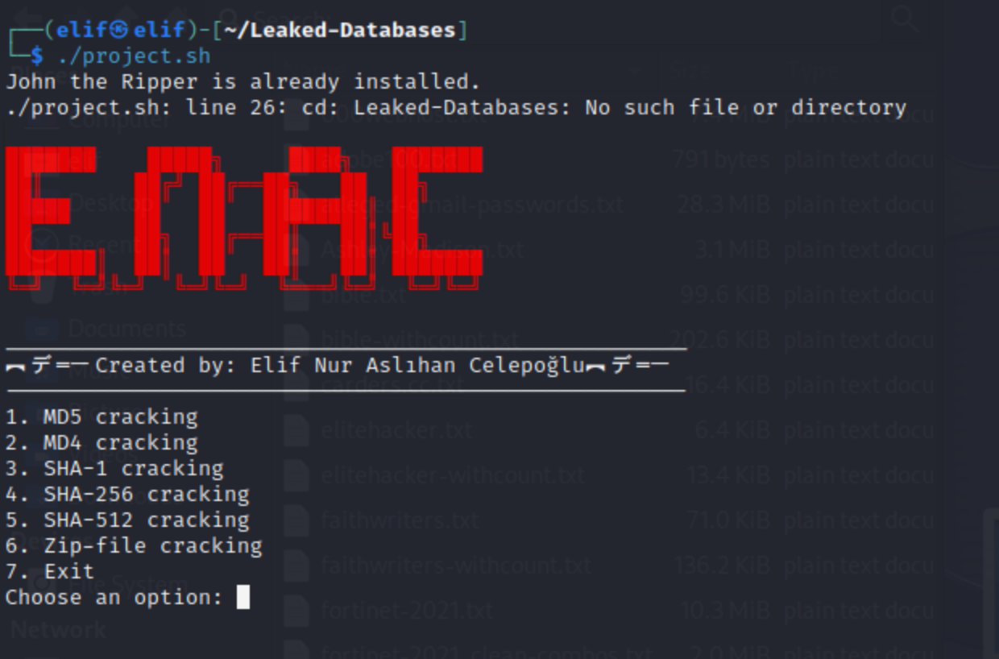

# John-The-Ripper





## Overview
This project demonstrates the use of John the Ripper on Kali Linux to analyze the effectiveness of password policies and protection measures. The project includes various cracking methods and provides a user-friendly interface for educational and informational purposes in the field of cybersecurity.

## Features
- Password cracking using John the Ripper
- Dictionary mode and brute-force attacks
- Bash script interface for ease of use
- Online hash generation and cracking

## Files and Directories
- **engineering_report.pdf**: Detailed report on the project.
- **md4.txt, md5.txt, sha1.txt, sha256.txt, sha512.txt**: Example hash files.
- **project.sh**: Main script for running the project.
- **rockyou-**: Various wordlist files.
- **test.txt, test.zip**: Test files.

## Installation and Setup

### Download and Set Up Kali Linux on VMware Fusion
1. **Download VMware Fusion:**
    - Visit the [VMware Fusion](https://www.vmware.com/products/fusion.html) website and download the latest version.
    - Install VMware Fusion on your Mac.

2. **Download Kali Linux ISO:**
    - Visit the [Kali Linux Downloads](https://www.kali.org/get-kali/#kali-virtual-machines) page.
    - Download the Kali Linux VMware image.

3. **Set Up Kali Linux on VMware Fusion:**
    - Open VMware Fusion and select "New" to create a new virtual machine.
    - Choose "Import an existing virtual machine."
    - Locate the downloaded Kali Linux VMware image and follow the prompts to complete the setup.

### Project Setup
1. **Clone the repository:**
    ```sh
    git clone https://github.com/elif1906/John-The-Ripper.git
    ```
2. **Navigate to the project directory:**
    ```sh
    cd John-The-Ripper
    ```
3. **Install John the Ripper:**
    ```sh
    sudo apt-get update
    sudo apt-get install john
    ```
4. **Run the project script:**
    ```sh
    bash project.sh
    ```^

## Usage
- **Password Cracking**: Use the provided script and wordlists to perform dictionary attacks or brute-force attacks.
- **Hash Analysis**: Analyze different types of hashes provided in the example files.

## Disclaimer
This project is for educational and informational purposes only. It is intended to understand cybersecurity fundamentals and hacking defense techniques.

## License
This project is licensed under the MIT License - see the [LICENSE](LICENSE) file for details.

For more details, visit the [GitHub repository](https://github.com/elif1906/John-The-Ripper).
